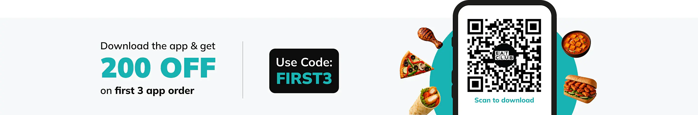

# 🍽️ EatClub — Visual Clone (Complete Project Documentation)

A fully responsive front-end visual clone of the **EatClub** (Swigato-style) landing page.  
This project demonstrates modern front-end practices using **HTML**, **CSS**, and **JavaScript**, with clean structure, reusable styles, and optional dynamic data loading.

---

## 📘 Overview

This project recreates a professional food-delivery web layout, focusing on:
- **Reusable components** — Header, Hero/Carousel, Offers, Grid, Footer  
- **Responsive design** — Works across desktop and mobile  
- **Data-driven approach** — Optional JSON-based dynamic rendering  
- **Modern UI techniques** — Flexbox, CSS Grid, Font Awesome, semantic HTML  

---

## 🗂️ Project Structure

📁 eatclub-clone/
│
├── swigato.html # Main HTML page
├── style.css # CSS styling and layout
├── script.js # JS for interactivity / dynamic data
├── data.json # Optional JSON data file
├── assets/
│ ├── logo.webp
│ └── eatclub-download-banner.webp
├── Screenshot 2025-11-11 at 7.34.23 AM.png
├── Screenshot 2025-11-11 at 7.34.33 AM.png
└── Screenshot 2025-11-11 at 7.34.40 AM.png

---

## 🖼️ Preview

| Section | Screenshot |
|----------|-------------|
| Header & Hero |  |
| Offers Row & Grid |  |
| Footer & Banner |  |

---

## 🚀 How to Run

You can directly open the project in your browser:

1. Keep all files in one folder.
2. Double-click `swigato.html` to open it in your browser.  
3. For editing and live preview:
   - Open the project in **VS Code**.
   - Install the **Live Server** extension.
   - Right-click `swigato.html` → **Open with Live Server**.

> 💡 *Using Live Server automatically reloads your browser whenever you save a change.*

---

## 🧩 HTML — Section by Section Breakdown

### 🧭 1. Header / Navbar

```html
<header class="header">
  
  <div class="inputParent">
    <input type="text" class="inputNav" placeholder="Live to eat">
    <button class="btnNav"><i class="fa-solid fa-magnifying-glass"></i></button>
  </div>
  <nav class="header-right">
    <button class="pill">Why EatClub?</button>
    <button class="pill">Deals</button>
    <button class="pill">Cart</button>
    <button class="pill primary">Get the app</button>
    <button class="pill secondary">Sign in</button>
  </nav>
</header>
Purpose:
Displays brand logo, search input, and navigation buttons. The “pills” are styled call-to-action elements.
Customization:

Replace logo.webp with your brand logo.
Add more <button> or convert them to <a> links for real navigation.
Update the search bar placeholder text in .inputNav.
🌄 2. Hero / Carousel
<section class="hero" id="hero" aria-label="hero">
  <!--  -->
</section>
Purpose:
Large banner area showcasing offers, featured restaurants, or download QR.
Ideas for improvement:

Add a carousel using JavaScript (auto-slide through 3–4 banners).
Or simply show a single hero banner like:

Styling tip:
Set a background gradient overlay using CSS for contrast against white text.
💸 3. Top Offers Row
<h3>Top offers today</h3>
<div class="offers-row" role="list">
  <div class="offer" role="listitem">
    
    <div class="label">Happy Hours</div>
  </div>
  <!-- More offers -->
</div>
Purpose:
Highlights current promotions as image tiles.
CSS behavior:

.offers-row uses grid or flex layout with equal-width banners.
.offer cards include an image and label overlay.
Customization tips:
Replace src URLs with your own banners.
Add more offers by duplicating .offer divs.
To make it horizontally scrollable on small screens:
.offers-row {
  display: flex;
  overflow-x: auto;
  gap: 16px;
  scroll-snap-type: x mandatory;
}
.offer { scroll-snap-align: start; min-width: 200px; }
🍱 4. Restaurants Grid (Cards)
<section id="grid" class="grid" aria-label="restaurants">
  <article class="rest-card">
    <div class="rest-media">
      
      <div class="badge">
        
      </div>
    </div>
    <div class="rest-body">
      <h3>LeanCrust Pizza</h3>
      <p>The Thin Crust Experts</p>
    </div>
  </article>
  <!-- More cards -->
</section>
Purpose:
Displays different restaurant/brand options as cards.
Key elements:

.rest-card — main container with shadow & border-radius.
.rest-media — top image container, with a .badge overlay for brand logo.
.rest-body — restaurant title and description.
Dynamic tip:
Use JavaScript to generate cards from data.json (see below).
📱 5. Download Banner
<article>
  
</article>
Purpose:
Large promotional area encouraging users to download the app.
Tip:
Use a high-resolution image and loading="lazy" for performance:


🦶 6. Footer
<footer class="site-footer">
  <div class="footer-grid">
    <div class="col">
      <h2>EatClub</h2>
      <p>A membership program that takes you straight to curated restaurants...</p>
    </div>
    <div class="col">
      <h4>Company</h4>
      <ul><li>About Us</li></ul>
    </div>
    <div class="col">
      <h4>Get Help</h4>
      <ul><li>Contact us</li><li>Help & Support</li></ul>
    </div>
    <div class="col">
      <h4>Explore</h4>
      <ul><li>Offers</li><li>Bulk Order</li></ul>
      <div>
        
        
        
      </div>
    </div>
  </div>
</footer>
Purpose:
Displays brand info, quick links, and social media icons.
Tips:

Wrap <li> elements in <a> tags for clickable navigation.
Ensure good color contrast with background.
🎨 CSS — What Controls What
Section	Key Classes	Purpose
Header	.header, .logo, .pill, .btnNav	Aligns logo, search box, nav buttons
Hero	.hero, .heroImg	Defines banner height and layout
Offers	.offers-row, .offer, .label	Creates offer tiles with images
Grid	.grid, .rest-card, .badge, .rest-body	Defines restaurant cards
Banner	.banner	Controls full-width promo image
Footer	.site-footer, .footer-grid, .col	Sets footer layout and text styling
Responsive	@media (max-width:...)	Adjusts layout for smaller screens
Customization idea:
Define color variables in :root:
:root {
  --primary: #ff4d00;
  --text-dark: #222;
  --bg-dark: #121212;
  --radius: 16px;
}
and use them across components for a consistent theme.
⚙️ JavaScript — Recommended Enhancements
Populate Offers Dynamically from data.json
document.addEventListener('DOMContentLoaded', async () => {
  const res = await fetch('./data.json');
  const data = await res.json();
  const offersRow = document.querySelector('.offers-row');

  offersRow.innerHTML = '';
  data.offers.forEach((offer) => {
    const div = document.createElement('div');
    div.className = 'offer';
    div.innerHTML = `
      
      <div class="label">${offer.name}</div>
    `;
    offersRow.appendChild(div);
  });
});
Populate Restaurant Cards Dynamically
document.addEventListener('DOMContentLoaded', async () => {
  const res = await fetch('./data.json');
  const data = await res.json();
  const grid = document.querySelector('.grid');

  grid.innerHTML = '';
  data.restaurants.forEach((r) => {
    const card = document.createElement('article');
    card.className = 'rest-card';
    card.innerHTML = `
      <div class="rest-media">
        
        <div class="badge">
          
        </div>
      </div>
      <div class="rest-body">
        <h3>${r.name}</h3>
        <p>${r.subtitle}</p>
      </div>
    `;
    grid.appendChild(card);
  });
});
